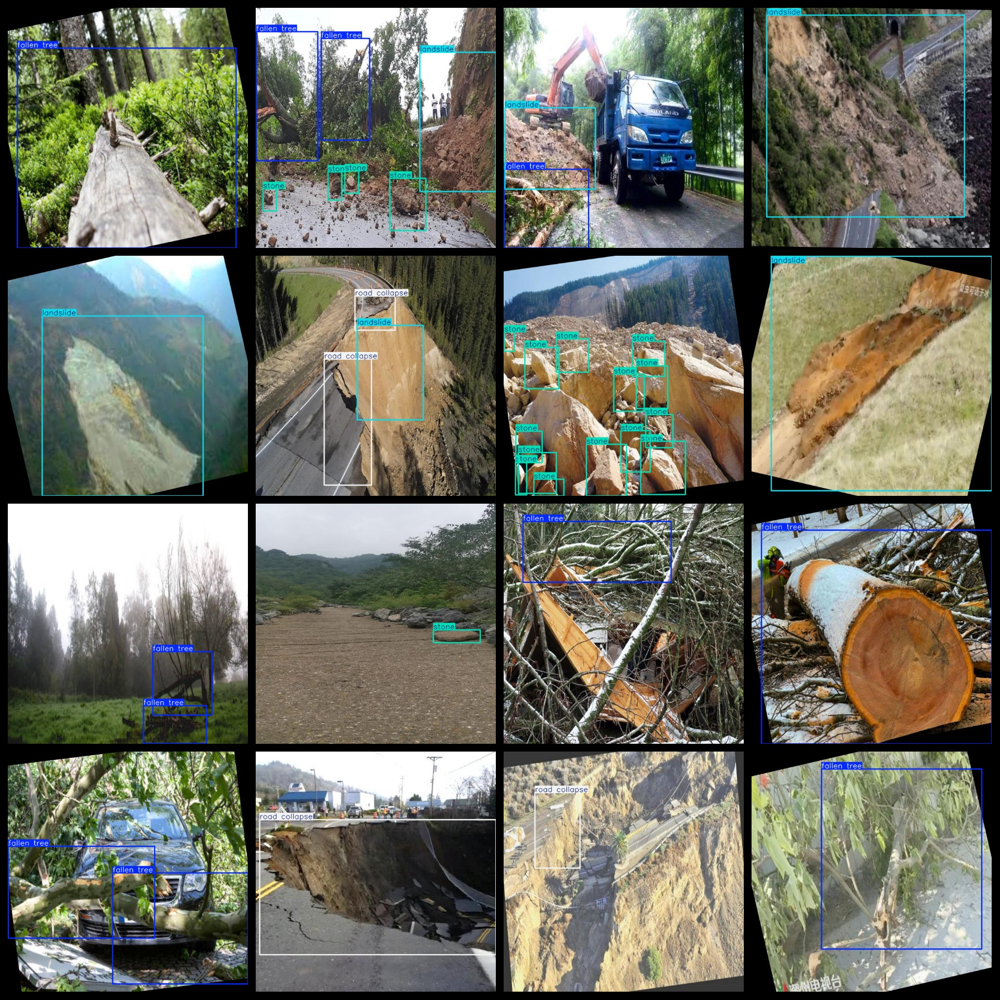

# [Object Detection] Landslide, Road Collapse, Tree Knockdown, Rock Detection Dataset - 19000 Images with YOLO+VOC ((Augmented))

Dataset format: VOC format + YOLO format

Compressed within the zip file: 3 folders, each storing images, xml files, and txt files

JPEGImages folder contains a total of 19151 JPG images

Annotations folder contains a total of 19151 xml files

labels folder contains a total of 19151 txt files

Number of labels: 4

Label names: ["fallen tree", "landslide", "road collapse", "stone"]

Each label's number of bounding boxes (Note: the order of categories in the YOLO format doesn't match this, but is based on the classes.txt in the labels folder):

- fallen tree bounding box count = 11037 (collapsed trees)

- landslide bounding box count = 7818 (landslide)

- road collapse bounding box count = 6416 (road collapse)

- stone bounding box count = 25155 (stone)

Total bounding box count = 50426

Image resolution: Clear

Image enhancement: No

Label shape: Rectangular bounding boxes for target detection recognition

Important note: No guarantees are made regarding the accuracy or weight files of the trained models. The dataset provides accurate and reasonable annotations only.

## Images

---

Here is a pay link on Stripe (https://buy.stripe.com/3cs8yP7sY87d0vu9AB). Please contact me lonlonago@foxmail.com after funding $89, and I will send you a complete data files, thank you!

